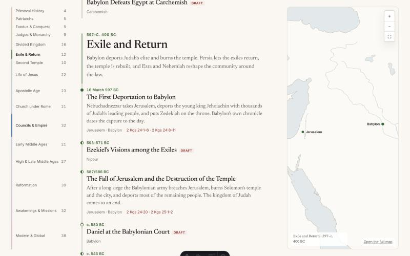

# Christwiki

A timeline-first wiki of the core moments of Christianity, from the opening of Genesis to the present. Every entry shows when and where something happened, how it connects to the rest of the story, and the primary sources it rests on.

**[christwiki.org](https://christwiki.org)**

- **Timeline** grouped by era, with a linked map that follows what you read.
- **Events, people, places, sources and threads**, all cross-linked.
- **Every claim cited** to a primary source at passage level, one click from the text.
- **Every date labelled** firm, estimated, traditional or undated, with a note on how it is known.
- A static site: no server, no database, no trackers, no outside requests.

The first release holds 361 events in sixteen eras, with 631 people, 254 places and 1,037 source records. Every event has been checked by a second pass that did not write it.



## What is in this repository

The content of the wiki and its settings. The pages, the design and the tools are a theme, **[chronowiki](https://github.com/christwiki/chronowiki)**, which anyone can use to build a history wiki of their own.

```
wiki.config.ts            the wiki's name, languages and map regions
astro.config.mjs          the site's address, and the line that adds the theme
src/content/
  eras/<id>.md            events/<era>/<id>.md    people/<id>.md
  places/<id>.md          sources/<id>.md         threads/<id>.md
  pages/about.md          i18n/<language>/<collection>/<id>.md
src/messages/             Christwiki's own wording, laid over the theme's
scripts/seed/outline.yaml the outline of events
docs/                     the standard every entry must meet
tests/e2e/                browser tests against the built site
```

## Found a mistake?

If a citation does not support the sentence it is attached to, if a link is broken, or if an entry is unfair to a tradition, that is a defect and will be corrected. [Open an issue](https://github.com/christwiki/christwiki/issues) with the page and the passage.

## Working on it

Requires Node 22.12 or newer.

```bash
npm install
npm run dev            # development server at http://localhost:4321
```

| Command | What it does |
|---|---|
| `npm run dev` | Development server. Drafts are shown, and content errors are logged instead of stopping the page. |
| `npm run validate` | Check every content file: schemas, references, citations, the source policy. |
| `npm run validate -- --era <era-id>` | The same for one era and what its events reference. |
| `npm run build` | Validate, build the site into `dist/` and build the search index. |
| `npm run build:release` | The same with the strict rules: no drafts, no orphans, every event independently checked. |
| `npm run e2e` | Browser and accessibility tests against the built site. |
| `npm run check` | Type-check. |
| `npm run i18n -- status` | How much of each language is translated and what is out of date. Also `new` and `stamp`: see [docs/i18n.md](docs/i18n.md). |
| `npm run check:links` | Request every external link in the content and report the broken ones. Results are cached for a week (`-- --no-cache` ignores them); `-- --only <text>` checks only matching links. Sites that refuse automated requests are listed separately, to be opened by hand. |
| `npm run seed` | Create stub files for any event, person or place in the outline that has no file yet. |

Three environment variables change a build: `SHOW_DRAFTS=true` includes unfinished entries, `LENIENT_CONTENT=true` logs broken links and citations instead of failing, and `PREVIEW_LOCALES=true` builds the languages that are still in preview. All three are meant for work in progress, not for a release.

## Writing and translating

**[docs/authoring-guide.md](docs/authoring-guide.md)** is the standard every entry must meet: what counts as a primary source, how to cite, how dates are labelled, the file formats and the inline syntax. Read it before adding or changing an entry.

The site is written in English and built to be read in any language. A translation of an entry holds only its words, laid over the English entry, so dates, places and citations are shared and cannot drift apart. An entry without a translation is shown in English and says so. German is the first other language, in preview. **[docs/i18n.md](docs/i18n.md)** explains how to translate.

## Publishing

Every push to `main` is checked and published to [christwiki.org](https://christwiki.org) by the workflow in `.github/workflows/deploy.yml`: the strict validation, the build, and the browser tests against that build.

To build it anywhere else, `npm run build:release` writes the complete site to `dist/`. To serve it from another address or a sub-path:

```bash
SITE_URL=https://example.org BASE_PATH=/wiki/ npm run build:release
```

## Licences

- **The text** of the entries, in `src/content/`, is under the [Creative Commons Attribution-ShareAlike 4.0 licence](LICENSE-CONTENT). You may reuse and adapt it if you credit Christwiki and share what you make under the same licence.
- **The code** in this repository is under the [MIT licence](LICENSE).
- Scripture is quoted from the World English Bible, which is in the public domain. Other quotations are from public-domain translations.
- Map data and typefaces come with the theme: [Natural Earth](https://www.naturalearthdata.com/) (public domain), Newsreader and Inter (SIL Open Font License 1.1).
